# Jet Moto Anthology

Native PC ports of **Jet Moto** (SCUS-94309), **Jet Moto 2: Championship
Edition** (SCUS-94167) and **Jet Moto 3** (SCUS-94555), produced by static
recompilation with [RecompOne](https://github.com/BlackLabelHQ/RecompOne).

All three boot, render, take controller input and race. Dithering is removed
outright, the frame pacing matches the original, and the CD soundtrack plays —
which it never did on any of these ports before, because the runtime had no
redbook audio at all.

| Game | State |
|------|-------|
| **Jet Moto** | Complete — a full 3-lap race played end to end |
| **Jet Moto 2** | Playable — boots, menus, controls, races |
| **Jet Moto 3** | Playable — boots, menus, controls, races at a locked 60 fps, 640x480 |

## Screenshots

Captured from these ports, not from an emulator.

**Jet Moto**

| | |
|---|---|
| 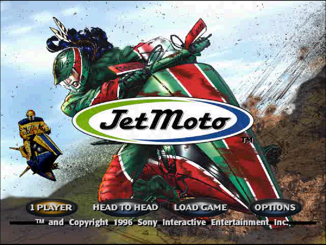 | 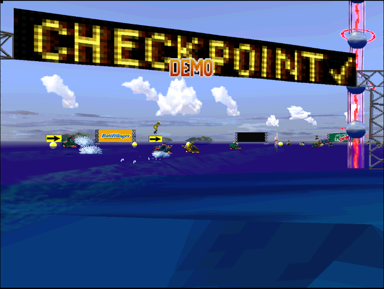 |
| 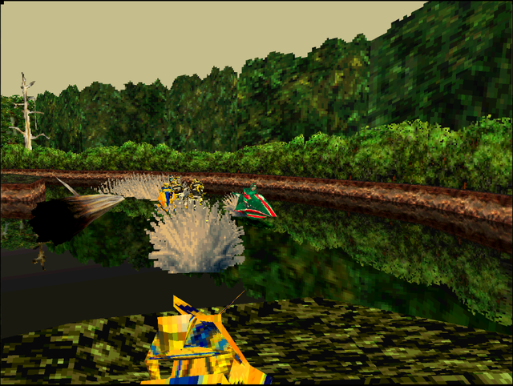 | 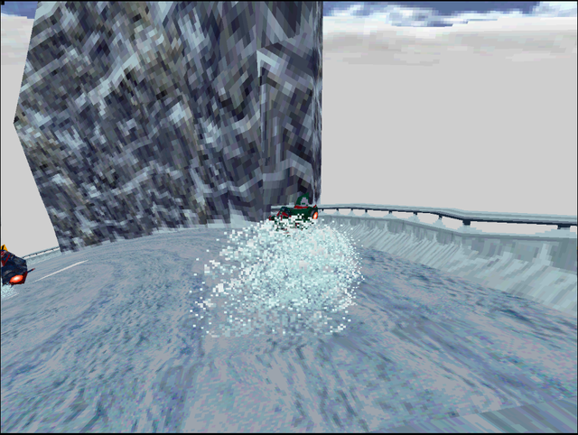 |

**Jet Moto 2**

| | |
|---|---|
| 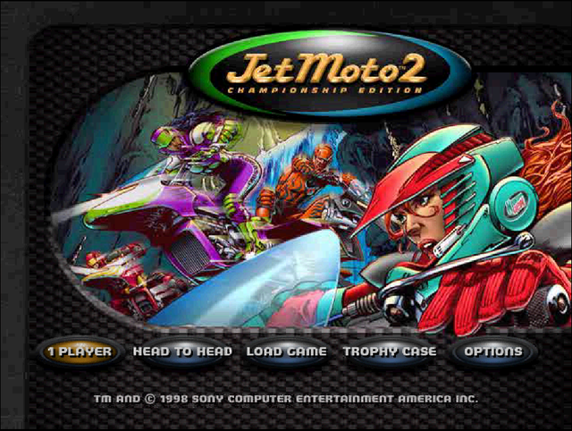 | 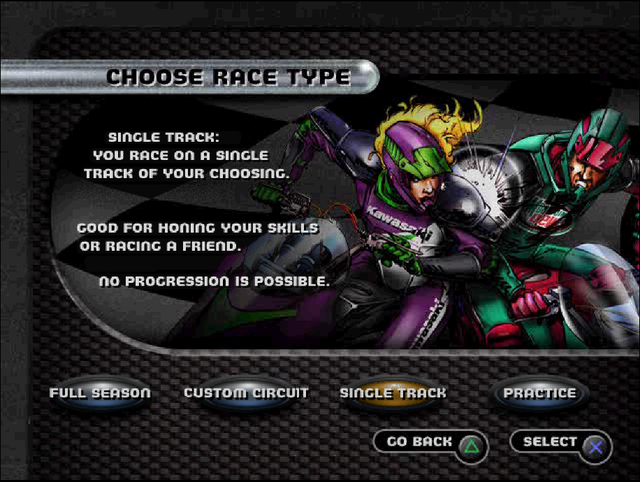 |
| 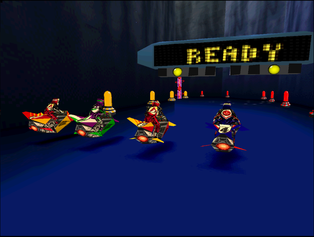 | 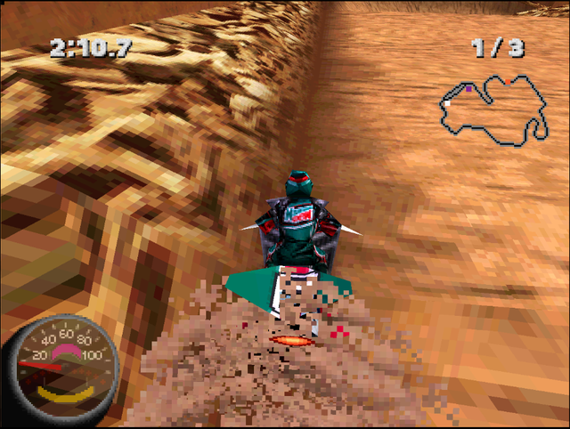 |

**Jet Moto 3**

| | |
|---|---|
| 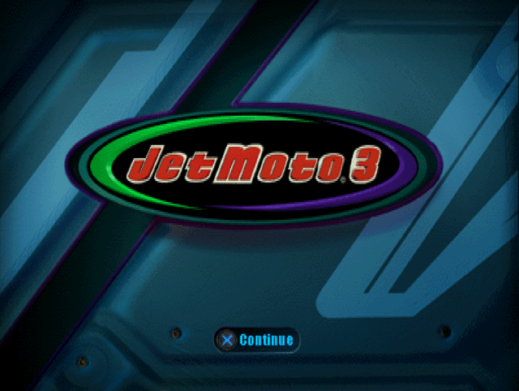 | 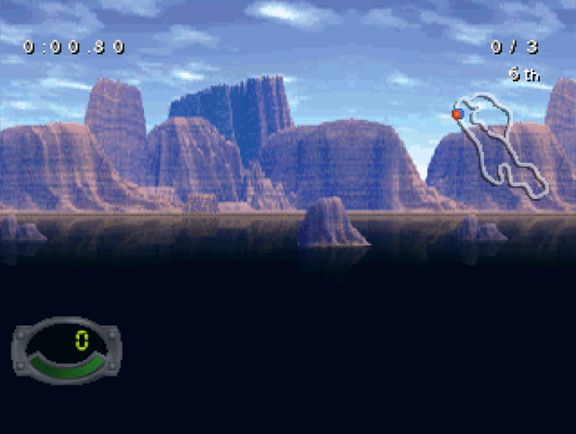 |
| 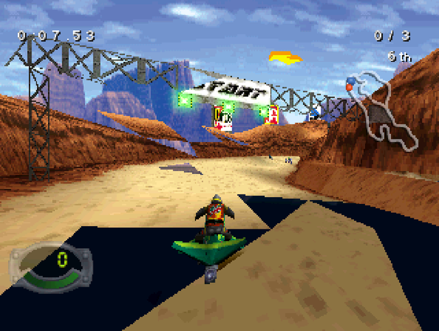 | 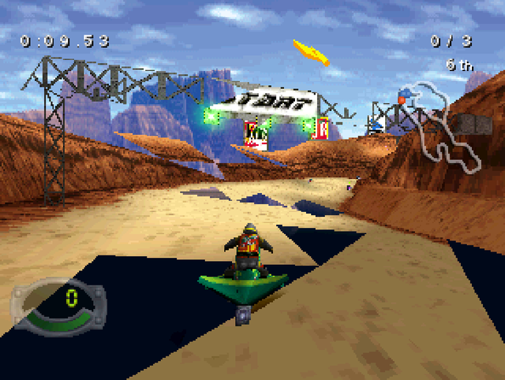 |

## Get it

Three downloads on the [releases page](https://github.com/GTTeancum/Jet-Moto-Anthology/releases),
one per game. Each is a **single executable** — no .NET, no SDK, no build step,
no loose DLLs.

| | |
|---|---|
| `JetMoto.exe` | Jet Moto |
| `JetMoto2.exe` | Jet Moto 2 |
| `JetMoto3.exe` | Jet Moto 3 |

Put your disc rip in the same folder and double-click. If it cannot find a disc
it opens a file picker and asks. Or point it straight at one:

```
JetMoto2.exe --disc "D:\rips\Jet Moto 2 (v1.1).cue"
```

Install all three side by side if you like — each looks for its own disc and
keeps its own cache, so having every rip present is fine.

The first launch spends 10–30 seconds translating your disc's executable and
saves the result in `cache/`. Every launch after that starts immediately.

### You supply the game

The downloads contain **no game code and no game data** — not the executable,
not the assets, not the recompiled output. The recompiler runs on your machine,
against your disc. Without one, the program does nothing but say so.

A prebuilt port binary would have the game's entire executable compiled into it,
translated line for line; that artifact is the game. Doing the translation at
first launch is what makes a release possible.

### Options

```
JetMoto.exe [--disc <path>] [--extract [folder]] [--rebuild]
```

| | |
|---|---|
| `--disc <path>` | a `.cue`, or a folder made by `--extract` |
| `--extract [folder]` | unpack the disc to loose files with an ogg soundtrack |
| `--rebuild` | discard the cached recompilation and redo it |

Default keys: arrows = D-pad, `Z` Cross, `X` Circle, `A` Square, `S` Triangle,
`Enter` Start, `Q`/`W` L1/R1.

Jet Moto 3 renders at 640x480 internally, which holds a locked 60 fps even in
its heaviest scenes. The 4x upscale the other two default to costs twenty-four
times as much in the presenter and drops it to about 21 fps, so it is not the
default here; `RECOMPONE_RES_SCALE=1|2|4` overrides, and the in-game display
settings switch it too.

`RECOMPONE_FRAME_DIVIDER=2` gives the original's 30 Hz pacing. A log is written
to `jetmoto.log` beside the binary, flushed per line so a crash still leaves a
record; the previous run is kept as `jetmoto.prev.log`.

`ffmpeg` on PATH is optional, and only used by `--extract` for the soundtrack.

## Loose files and the ogg soundtrack

Either game will boot from an extracted tree of loose files instead of a
bin/cue image, and prefers it when one is present:

```
JetMoto.exe --disc "Jet Moto (USA).cue" --extract JetMoto_loose
```

The folder **is** the disc root — the executable and `SYSTEM.CNF` sit at the top
exactly where the disc had them:

```
JetMoto_loose/
  SCUS_943.09          the executable, at the root
  SYSTEM.CNF
  ALPINE1/ STARTUP/ MISC/ PICKTRAC/ ...
  cdaudio/*.ogg        the soundtrack, one file per CD-DA track
  .disc/               manifest and sector map, kept out of the disc root
```

Everything above the CD layer addresses the disc by **sector**, not by file —
the game's own ISO reader, overlay loading, `CdSearchFile`, the recompiler
config. So this is not merely a folder of files: the runtime rebuilds a
byte-faithful view of the data track from it, at the original LBAs.
`tools/extract-disc.py` is the reference implementation of the same format and
can prove that, sector by sector:

```bash
python tools/extract-disc.py --cue "Jet Moto (USA).cue" --out JetMoto_loose --verify
# verify: 34186/34186 sectors identical
```

Turning the redbook tracks into ogg takes the soundtrack from ~450 MB of raw PCM
to ~45 MB, and makes it playable in any music player. Same-size-or-smaller edits
to loose files take effect in game; larger ones would need the ISO structure
rebuilt, which the tooling does not do.

`RECOMPONE_DISC=<path>` forces a specific disc of either kind.
`RECOMPONE_DISC_PREFER=cue` keeps the image even when loose files exist.

## Build from source instead

Requires the [.NET 10 SDK](https://dotnet.microsoft.com/download).

```bash
git clone https://github.com/GTTeancum/Jet-Moto-Anthology.git
cd Jet-Moto-Anthology
./build.sh --game jm1 --cue "/path/to/Jet Moto (USA).cue"     # or build.ps1
```

That clones RecompOne, applies the fork patch, recompiles your disc's executable
and builds the port into `JetMoto/bin/Release/net10.0/`. To build the launcher
the release ships:

For repeated Jet Moto 3 graphics work, the development binary can skip its FMV
wrappers and drive directly to a named track:

```bash
dotnet JetMoto3/bin/Release/net10.0/JetMoto3.dll --canyon
dotnet JetMoto3/bin/Release/net10.0/JetMoto3.dll --track ice
```

The available track switches are `--canyon`, `--ice`, and `--volcano`.

To publish Jet Moto 3 as one self-contained Windows executable and place it in
the extracted-disc directory:

```powershell
./tools/deploy-jetmoto3.ps1
```

The script bundles managed and native dependencies into `JetMoto3.exe` and
removes obsolete DLL/runtime files from the verified deployment directory.
Window resolution, internal render scale, and FXAA are available under
**Settings > Display**.

```bash
dotnet publish Launcher/JetMotoLauncher.csproj -c Release -r win-x64 --self-contained
```

That produces one `JetMoto.exe`. The three shipped executables are the same
binary under three names — each reads its own file name to know which game it
is, which is why `JetMoto2.exe` looks for the Jet Moto 2 disc and ignores the
others.

## What this took

RecompOne routes PSYQ SDK calls to its own runtime by matching function names as
strings. With no decompilation to work from, every function starts as
`func_800XXXXX` and nothing is routed, so naming the SDK entry points is the
whole critical path. They were recovered from the PSYQ debug string pool, which
both retail builds kept.

The three games then diverged completely. Jet Moto reaches the disc through the
libcd HLE and the controller through the BIOS pad calls. **Jet Moto 2 reaches
both through the hardware**, which meant the parts of the runtime nobody had
exercised:

- The CD sector streamer was never driven, the drive ignored `Setmode`'s
  2340-byte sector size, IRQ 2 never reached the CPU, and the request-data bit
  rewound the sector FIFO.
- 21 overlays had to be registered — the shell and 20 per-track binaries, none
  carrying a PS-X EXE header, their load addresses recovered by scoring
  candidates against `jal` targets and string-pool alignment.
- There was **no SIO0 controller port** in the runtime at all, and handlers
  registered through `SysEnqIntRP` were stored and never walked. Jet Moto 2
  ships its own pad driver and needs both.

**Jet Moto 3 is a different studio and a different engine**, and what it needed
was interrupt timing rather than devices:

- Interrupts nested. Hardware masks them for the duration of a handler; nothing
  here did, and Jet Moto 3's pad driver runs inside the vblank chain and walks
  the SIO port a byte at a time. A vblank fired inside it, the nested copy took
  the byte, and the outer copy spun forever.
- Handlers ran on whatever stack the interrupted code had. Jet Moto 3 parks its
  stack pointer at the scratchpad base for a hot routine, so a handler taken
  there pushed its frame off the end of the scratchpad.
- The GPU DMA completion interrupt was raised from inside the register write
  that started the transfer, which re-entered libgpu before the request it had
  just started was marked in flight. It restarted the same ordering table until
  the stack ran out.

`DECISIONS.md` records the reasoning, including the wrong turns — of which the
largest was three sessions spent treating Jet Moto 3 as a movie-decode problem
when the movies were never the problem.

## Layout

```
Launcher/               the shipped executable: recompiles on first run
JetMoto/, JetMoto2/, JetMoto3/   port projects: entry point, config, funcmaps
harness/                verification: frame capture, scripted input, disc tools
tools/extract-disc.py   disc -> loose files + ogg soundtrack, with --verify
tools/recompone-fork.patch   runtime fixes, every hunk tagged [jetmoto-fork]
tools/apply-fork.sh     re-create the fork from a clean upstream checkout
DECISIONS.md            why things are the way they are
STATUS.md               where the ports stand
```

`tools/RecompOne/` is an upstream checkout and is not committed; the fork lives
entirely in the patch so it survives a re-clone.

## Credits and licensing

- [RecompOne](https://github.com/BlackLabelHQ/RecompOne) by flaffy — MIT. The
  runtime fixes in `tools/recompone-fork.patch` are modifications to it and
  carry the same licence. They are **not** submitted upstream: the maintainer
  does not accept AI-authored contributions.
- Jet Moto, Jet Moto 2 and Jet Moto 3 are © Sony Interactive Entertainment.
  This project ships none of their code or data and is not affiliated with or
  endorsed by them.
- The port work in this repository was written with Claude (Anthropic).

Everything here that is ours is MIT licensed. See `LICENSE`.
