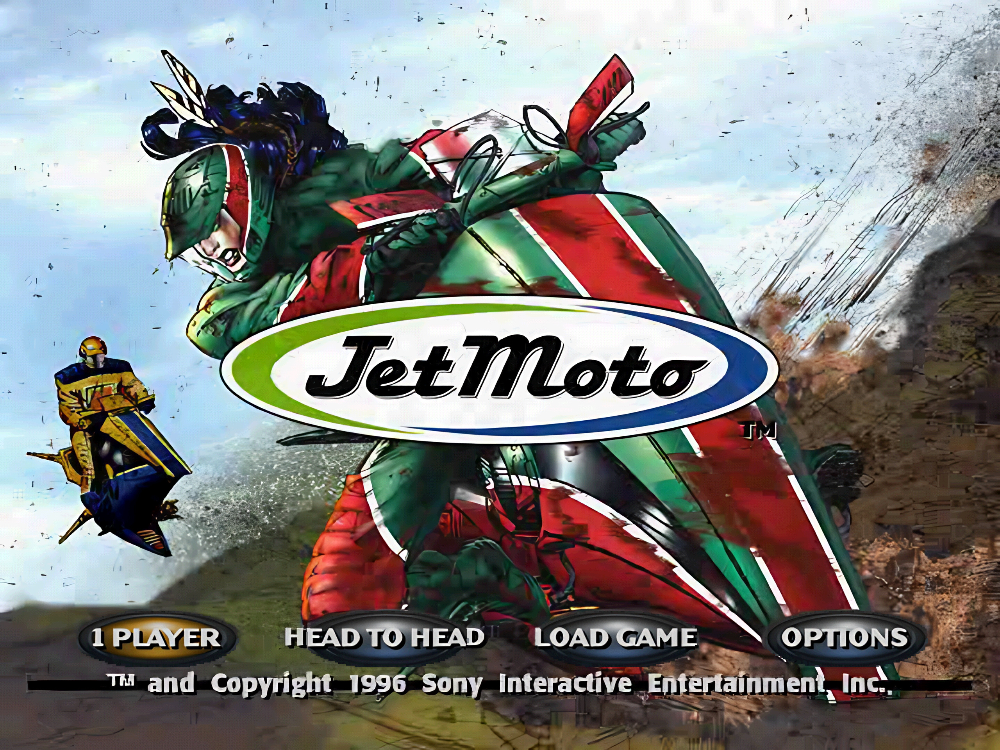
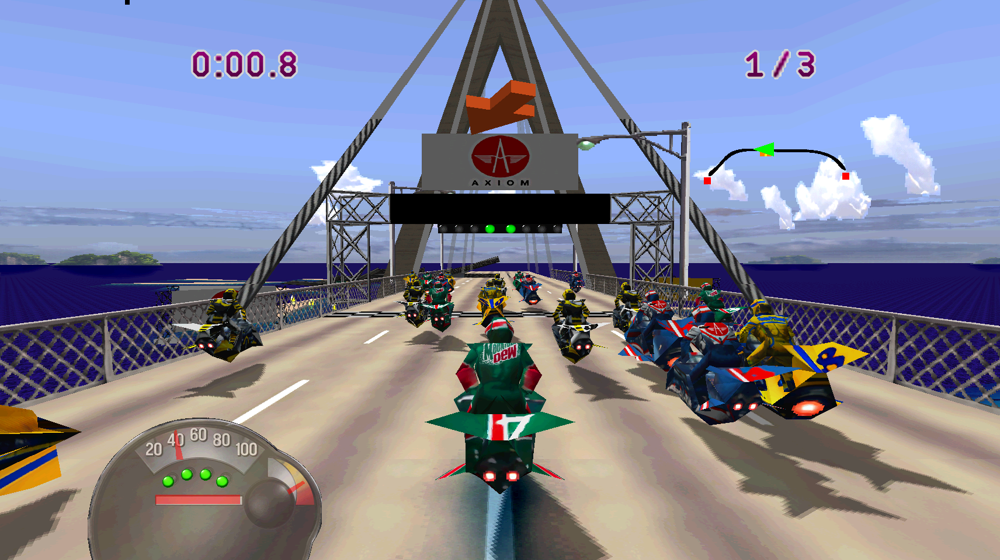
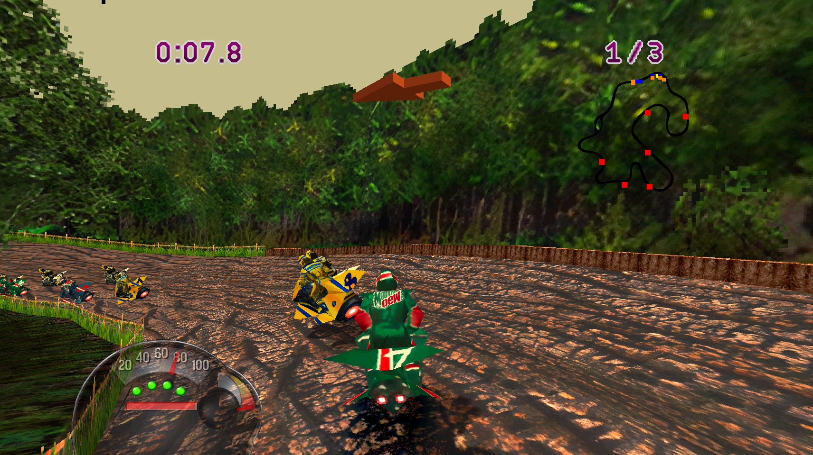
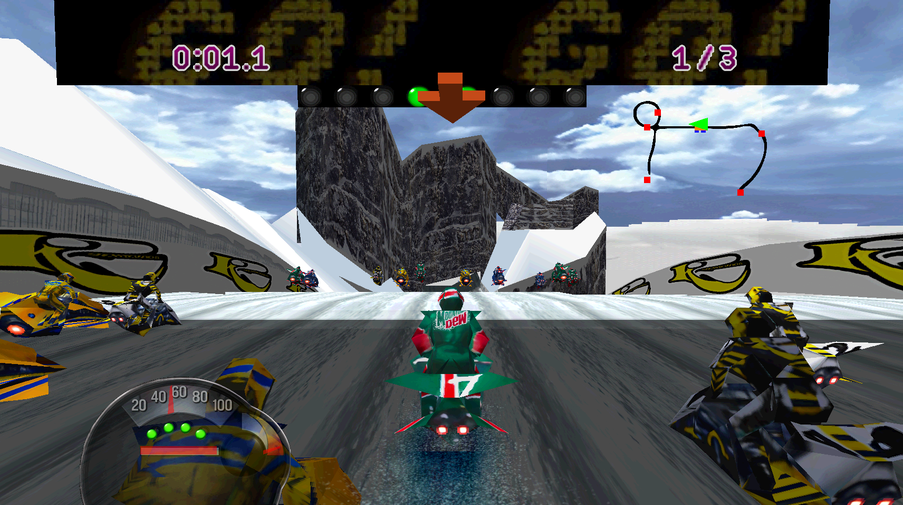
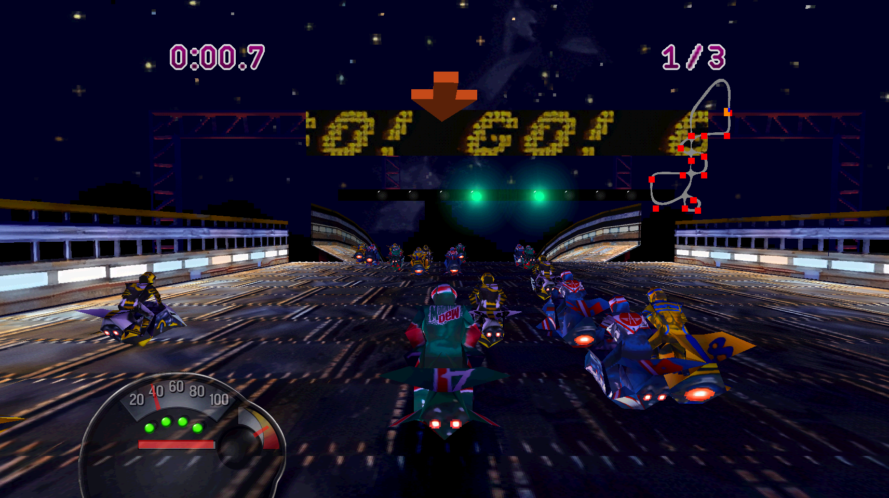

# Jet Moto Anthology

A native Windows recompilation of the original PlayStation **Jet Moto**, built on RecompOne, with refreshed artwork and rendering that keeps the original game's character.



<table>
  <tr>
    <td width="50%"><br><strong>Hammerhead</strong></td>
    <td width="50%"><br><strong>Blackwater Falls</strong></td>
  </tr>
  <tr>
    <td width="50%"><br><strong>Snow Blind</strong></td>
    <td width="50%"><br><strong>Nightmare</strong></td>
  </tr>
</table>

Screenshots captured directly from the game. Current work covers the first Jet Moto and all ten of its tracks.

## Features

- 4× textures, restored menu artwork, and refreshed HUD numerals, speedometer, boost lights, minimaps, and buoys.
- 16:9 gameplay with the original 4:3 menu presentation.
- Perspective-correct textures, subpixel projection, and dithering removal.
- Highest original rider and bike detail, directional world lighting, and projected rider shadows.
- Layered water shading and animated wake and spray effects.
- Session-only `--unlockall` for testing every track without changing saved unlock progress.

## Playing

Use a self-contained Windows x64 package and your own original **Jet Moto (USA)** disc image. Keep its CUE and all 14 referenced BIN tracks together beside `JetMoto.exe`, then launch the executable. Keep the accompanying libraries, `Textures`, and `Lighting` folders intact. A packaged build needs no separate .NET installation.

If your disc is elsewhere:

```powershell
.\JetMoto.exe --disc "D:\Games\Jet Moto\Jet Moto (USA).cue"
```

To make all ten tracks selectable for a testing session:

```powershell
.\JetMoto.exe --unlockall
```

The packaged `run.bat` enables this switch. Omit it for normal progression; ordinary saving still works. Disc images and saves are not included in this repository or release packages.

## Building and testing

This repository contains the project, runtime patches, asset tools, and tests. A fresh clone also needs the local RecompOne input kit, generated game source, and texture assets before it can build. See the [development guide](docs/development.md) for the Windows workflow and repository layout.

The current 0.12.0 candidate passed regression, renderer, deployment, and package checks, with native gameplay samples inspected on all ten tracks. Full races, exhaustive multiplayer coverage, and audio listening remain outside that validation. See [validation status](docs/validation.md) for evidence and rendering limits.

For a problem report, include the track, mode, steps to reproduce, and a screenshot when useful. `Collect-Logs.cmd` collects diagnostic logs and metadata without disc images, saves, or texture artwork; logs can contain local paths.

## Project details

The pinned RecompOne revision and original executable fingerprint are recorded in [provenance.json](provenance.json). Optional asset regeneration is documented in [LightingTools](LightingTools/README.md) and [TextureTools](TextureTools/MenuAssetExport/README.md). Original game names and artwork belong to their respective owners.